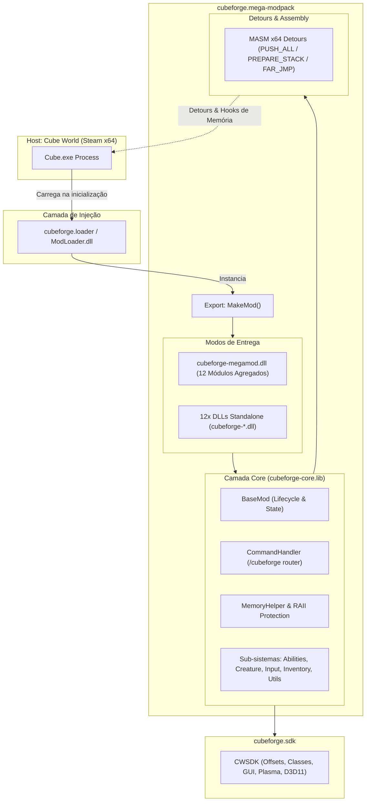

# cubeforge.mega-modpack

[](https://opensource.org/licenses/MIT)
[](https://microsoft.com)
[](https://isocpp.org)
[](https://cmake.org)
[](https://store.steampowered.com/app/1128000/Cube_World/)

**cubeforge.mega-modpack** é a reconstrução e modularização de alta performance do CubeMegaMod para o lançamento Steam de **Cube World**, integrado nativamente ao ecossistema **CubeForge** ([`cubeforge.sdk`](https://github.com/Gildofj/CWSDK) e [`cubeforge.loader`](https://github.com/Gildofj/Cube-World-Mod-Launcher)).

O modpack foi reestruturado sobre princípios de **Clean Architecture** e **Desacoplamento Modular**, disponibilizando um modelo de entrega dupla:
1. **12 Sub-mods Independentes** (`cubeforge-<modulo>.dll`): Para jogadores e desenvolvedores que desejam ativar seletivamente apenas funcionalidades pontuais.
2. **MegaModPack Bundle Consolidado** (`cubeforge-megamod.dll`): Um binário único de alta performance que agrega e orquestra todos os 12 submódulos com persistência de estado e menu unificado.

> [!IMPORTANT]
> **Faça backup dos seus dados salvos antes de iniciar o jogo com mods!**
> Os saves do Cube World residem em `%LOCALAPPDATA%\CubeWorld\Save\` ou `<CubeWorldFolder>\Save\`.

---

## 📑 Índice
- [🏛️ Arquitetura e Funcionamento](#️-arquitetura-e-funcionamento)
- [📂 Estrutura do Repositório](#-estrutura-do-repositório)
- [✨ Matriz de Módulos](#-matriz-de-módulos)
- [🎮 Comandos e Operação no Jogo](#-comandos-e-operação-no-jogo)
- [📦 Instalação e Configuração](#-instalação-e-configuração)
- [🛠️ Compilação via Código-Fonte](#️-compilação-via-código-fonte)
- [🧪 Testes Automatizados](#-testes-automatizados)
- [🤝 Contribuição e Padrões](#-contribuição-e-padrões)
- [❤️ Créditos & Agradecimentos](#️-créditos--agradecimentos)

---

## 🏛️ Arquitetura e Funcionamento

O ecossistema opera através de uma pipeline em camadas estritamente tipada em C++20 x64:



### Principais Mecanismos de Funcionamento:
- **`BaseMod` Lifecycle**: Cada módulo herda de `BaseMod`, provendo ciclo de vida padronizado (`Initialize`, `OnGameTick`, `OnChat`, `OnChestInteraction`, `OnCreatureDeath`, `OnLoreIncrease`, etc.).
- **Despacho Seguro de Hooks MASM x64**: Detours de baixo nível preservam o contexto dos registradores e garantem alinhamento da stack de 16 bytes antes de transferir a execução para os tratadores em C++.
- **Roteador `/cubeforge` Centralizado**: Um único despachante interpreta comandos de chat em tempo de execução sem afetar a performance do loop de renderização.
- **Isolamento de Estado & Persistência**: Configurações ativas e flags de módulos são sincronizadas em disco na pasta `Mods/` (em formato `.sav` / `.cwb`), persistindo o estado entre execuções do jogo.

---

## 📂 Estrutura do Repositório

```text
cubeforge.mega-modpack/
├── CMakeLists.txt              # Script mestre de compilação CMake (C++20, x64)
├── CMakePresets.json           # Presets de compilação unificados (Debug, Release, Test)
├── CMakeSettings.json          # Integração legada para Visual Studio Open Folder
├── build.bat / build.ps1       # Scripts de automação de build e empacotamento
├── cmake/
│   ├── CubeForgeSDK.cmake      # Integração FetchContent / Local do CWSDK
│   └── CubeForgeMod.cmake      # Macro modular add_cubeforge_mod()
├── docs/                       # Documentação técnica e arquitetural detalhada
│   ├── ARCHITECTURE.md         # Documento arquitetural aprofundado
│   ├── COMMANDS.md             # Manual completo de comandos no jogo
│   ├── CONTRIBUTING.md         # Diretrizes de contribuição e estilo de código
│   ├── features/               # Especificações detalhadas de cada feature
│   └── guides/                 # Tutoriais de compilação, instalação e criação de mods
├── src/
│   ├── core/                   # Camada estática cubeforge-core (base, utilitários, hooks)
│   │   ├── BaseMod.h/.cpp      # Ciclo de vida e despacho de eventos
│   │   ├── CommandHandler.h/.cpp # Parser de comandos /cubeforge
│   │   ├── abilities/          # Habilidades e eventos de combate
│   │   ├── creature/           # Factory e manipuladores de criaturas
│   │   ├── input/              # Abstração de teclado e double-tap DirectInput
│   │   ├── inventory/          # Manipulação e timers de inventário
│   │   ├── memory/             # MemoryHelper, FarJMP e RAII Protection
│   │   └── utils/              # RNG, colisões e drops
│   ├── mods/                   # Código-fonte dos 12 sub-mods independentes
│   │   ├── beginner_mode/      # Redução de dano para novatos (níveis 1-5)
│   │   ├── combat_updates/     # Mana->Stamina, Curas, Dash
│   │   ├── creature_updates/   # Buffs em pets e balanceamento de NPCs
│   │   ├── lore_interactions/  # Recompensas ao inspecionar lore
│   │   ├── player_updates/     # Classe Monk e novas raças
│   │   ├── quest_system/       # Sistema de missões procedurais
│   │   ├── region_lock/        # Decaimento suave de poder regional
│   │   ├── sea_exploration/    # Mergulho, oxigênio e baús submarinos
│   │   ├── shop_updates/       # Venda de artefatos e Spirit Cubes
│   │   ├── stack_updates/      # Limite de stacks para 100
│   │   ├── weapon_upgrades/    # Upgrades estilo Alpha no ferreiro
│   │   └── world_gen/          # Geração procedural com Simplex Noise
│   └── modpack/                # Orquestrador consolidado MegaModPack (cubeforge-megamod.dll)
│       ├── MegaModPack.h/.cpp  # Agregador mestre de submódulos
│       └── asm/                # Hooks MASM x64 consolidados
└── tests/                      # Suite de testes automatizados (CTest / x64-Debug)
    ├── main.cpp                # Runner de testes unitários e de integração
    ├── test_framework.h        # Framework de assertions e mocks
    ├── unit/                   # Testes unitários por subsistema
    └── integration/            # Teste de ciclo de vida completo do MegaModPack
```

---

## ✨ Matriz de Módulos

| ID | Sub-Mod | Binário Standalone | Descrição Técnica e Funcional |
| :---: | :--- | :--- | :--- |
| **1** | **Sea Exploration** | `cubeforge-sea-exploration.dll` | Sistema de mergulho com consumo de oxigênio/ouro (10g/10s), 4 tiers de baús submarinos e spawn de bosses aquáticos. |
| **2** | **Lore Interactions** | `cubeforge-lore-interactions.dll` | Recompensas progressivas com chance de drop de consumíveis raros e artefatos ao examinar objetos de lore. |
| **3** | **Combat Updates** | `cubeforge-combat-updates.dll` | Habilidade de converter Mana em Stamina (`Tecla 1`), Cura em 50-combo (`Tecla 2`) e esquiva evasiva via Double-Tap (`WASD`). |
| **4** | **Creature Updates** | `cubeforge-creature-updates.dll` | Multiplicador de +50% de atributos para mascotes domesticados, ajuste de dano em magos e bumerangues hostis e 40 Gold inicial. |
| **5** | **Shop Updates** | `cubeforge-shop-updates.dll` | Expansão de estoque no Gem Trader e Item Vendor, permitindo compra de Spirit Cubes, itens de travessia e artefatos. |
| **6** | **World Generation** | `cubeforge-world-gen.dll` | Geração procedural de biomas e ilhas através de Simplex Noise 2D e liberação de qualquer bioma como ponto de spawn inicial. |
| **7** | **Beginner Mode** | `cubeforge-beginner-mode.dll` | Redução dinâmica proporcional de dano e agressividade de criaturas hostis enquanto o personagem estiver entre os níveis 1 e 5. |
| **8** | **Region Lock Update** | `cubeforge-region-lock.dll` | Substituição do region-lock rígido por fórmula de atenuação suave por distância regional ($-2$ estrelas por região; $-1$ para itens `+`). |
| **9** | **Weapon Upgrades** | `cubeforge-weapon-upgrades.dll` | Reintrodução do sistema de adaptação e upgrade de tier de armas e armaduras no Ferreiro (mecânica do Cube World Alpha). |
| **10** | **Quest System** | `cubeforge-quest-system.dll` | Missões procedurais distribuídas por NPCs para caça de criaturas catalogadas, com entrega automática e recompensas diretas. |
| **11** | **Player Updates** | `cubeforge-player-updates.dll` | Implementação da classe customizada **Monk** (especializações *Chieftain* e *Sorcerer*), habilidades de combate e 7 raças jogáveis. |
| **12** | **Stack Updates** | `cubeforge-stack-updates.dll` | Patch binário direto na memória do cliente expandindo o limite máximo de stack de todos os itens do inventário para **100**. |
| **—** | **MegaModPack Bundle** | **`cubeforge-megamod.dll`** | **Pacote completo consolidado contendo todos os 12 submódulos integrados em uma única DLL de alta performance.** |

---

## 🎮 Comandos e Operação no Jogo

Abra o chat dentro do jogo pressionando `Enter`:

```text
/cubeforge status                 # Exibe resumo e total de módulos ativos/inativos
/cubeforge list                   # Lista todos os 12 submódulos, IDs, versões e estados
/cubeforge help                   # Imprime o manual de ajuda no chat
/cubeforge mod <id> <1/0>         # Ativa (1) ou Desativa (0) um submódulo em tempo de execução
/cubeforge combat doubletap <1/0> # Ativa ou desativa a esquiva via Double-Tap de movimento
/cubeforge sea autogold <1/0>     # Ativa ou desativa o consumo automático de ouro no mergulho
/cubeforge class <id>             # [Debug] Spawna um NPC com ID de classe especificado
/cubeforge anim <id>              # [Debug] Executa uma animação no jogador local
```

> [!NOTE]
> Comandos legados como `/mod <id> <1/0>`, `/enable doubletap` e `/enable autogoldusage` são suportados para manter total retrocompatibilidade.

---

## 📦 Instalação e Configuração

### Pré-requisitos
1. **Cube World (Steam x64)** instalado e atualizado.
2. **Microsoft Visual C++ Redistributable 2015–2022/2026 (x64)**.
3. Injetor de mods: [`cubeforge.loader`](https://github.com/Gildofj/Cube-World-Mod-Launcher) (recomendado) ou **Cube World Mod Launcher**.

### Passo a Passo
1. Localize a pasta de instalação do Cube World (ex: `C:\Program Files (x86)\Steam\steamapps\common\Cube World`).
2. Crie ou acesse a pasta `Mods/`.
3. Escolha uma das opções:
   - **Opção A (Recomendada - Pacote Completo)**: Copie `cubeforge-megamod.dll` para `Mods/`.
   - **Opção B (Modular)**: Copie apenas as DLLs standalone desejadas (ex: `cubeforge-stack-updates.dll`, `cubeforge-sea-exploration.dll`).
4. Inicie o jogo pelo **CubeForgeLoader** / Launcher.

---

## 🛠️ Compilação via Código-Fonte

O projeto utiliza **CMake Presets** padronizados para compilação multiplataforma com suporte a Visual Studio 2022, Visual Studio 2026 (Dev18) e Ninja.

### Compilando via CMake Presets (Recomendado)

```powershell
# Compilar versão de Desenvolvimento (Debug + Testes)
cmake --preset windows-debug
cmake --build --preset windows-debug

# Executar suite completa de testes unitários e integração
ctest --preset windows-test

# Compilar versão final Otimizada (Release)
cmake --preset windows-release
cmake --build --preset windows-release
```

### Compilando via Script Automatizado

```powershell
# Build completo em Release
.\build.ps1 -Config Release

# Build com execução automática de testes
.\build.ps1 -Config Debug -Test

# Limpeza e rebuild
.\build.ps1 -Clean -Config Release
```

Os binários compilados (`12 DLLs standalone` + `cubeforge-megamod.dll`) serão emitidos em `dist/Mods/`.

---

## 🧪 Testes Automatizados

A suite de testes (`cubeforge_tests.exe`) valida integralmente a camada lógica e as rotinas de memória sem depender da execução do cliente do jogo:
- **`test_simplex_noise`**: Precisão matemática do gerador de ruído 2D.
- **`test_timer_and_events`**: Disparo e cadência de timers de inventário e oxigênio.
- **`test_mod_settings_parser`**: Parser binário de configurações `.sav` e `.cwb`.
- **`test_abilities_and_classes`**: Cooldowns, conversão de mana e habilidades da classe Monk.
- **`test_quest_and_inventory`**: Rastreamento de abates, progressão e entrega de recompensas.
- **`test_megamod_lifecycle`**: Inicialização orquestrada, toggle dinâmico de módulos e integridade de memória.

Para rodar os testes:
```powershell
ctest --preset windows-test --output-on-failure
```

---

## 🤝 Contribuição e Padrões

Contribuições seguindo boas práticas de engenharia de software são muito bem-vindas:
- **Padrão de Linguagem**: C++20 estrito (`/permissive-`, `/W4`, `/utf-8`, `/Zc:__cplusplus`).
- **Memory Safety**: Use wrappers RAII (`MemoryProtectGuard`) para quaisquer alterações em páginas de memória.
- **ABI Compliance**: Manter runtime estático `/MT` e `_ITERATOR_DEBUG_LEVEL=0` para compatibilidade com o runtime do Cube World.
- **Testes Obrigatórios**: Qualquer nova feature deve acompanhar seus respectivos testes em `tests/unit/`.

---

## ❤️ Créditos & Agradecimentos

- **ChrisMiuchiz**: Autor original do CWSDK e Cube World Mod Launcher.
- **gijsgroenewegen**: Criador original do CubeMegaMod.
- **Ecossistema CubeForge**: Mantido por **Gildo FJ**.
- **Comunidade Cube World**: Feedback contínuo e relatórios de compatibilidade.

