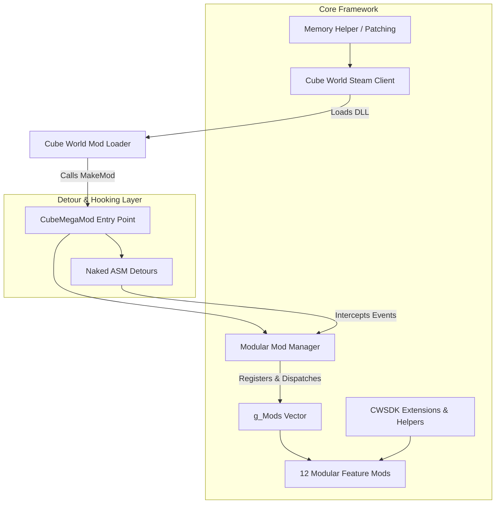
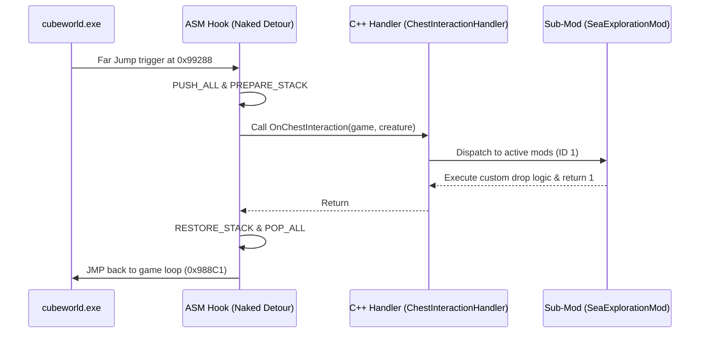

# Architecture & Technical Design

CubeMegaMod is a modular C++ mod for the Steam release of **Cube World**, built on top of the **Cube World SDK (CWSDK)**. It injects into the `cubeworld.exe` process as a native x64 dynamic link library (`DLL`) and patches runtime game memory, redirects control flow via assembly detours, and exposes an extensible object-oriented modding framework.

---

## 1. System Overview

---

## 2. Core Components

### 2.1 Mod Lifecycle & Dispatcher (`main.cpp` & `src/CubeMod.h`)
- **`GenericMod` Interface**: CubeMegaMod inherits from CWSDK's `GenericMod` and exports `MakeMod()`.
- **`CubeMod` Base Class**: All 12 internal feature modules inherit from `CubeMod`. Each sub-mod contains:
  - Unique identifier (`m_ID`)
  - Semantic versioning (`m_Version`)
  - Enable/Disable state toggle (`m_Enabled`)
  - State serialization routines (`Save()`, `Load()`) saving binary state to `Save/<FileName>.sav`
  - Event listener callbacks (`OnGameTick`, `OnChat`, `OnChestInteraction`, `OnLoreIncrease`, `OnCreatureDeath`, `OnShopInteraction`, etc.)

### 2.2 Memory Patching & Assembly Detours (`src/memory_helper/`, `src/hooks/`)
CubeMegaMod uses several techniques to hook into Cube World's proprietary engine:
1. **Direct Memory Modification (`MemoryHelper::PatchMemory`, `WriteByte`)**:
   - Changes opcode instructions (e.g. replacing conditional jumps `jnz (0x75)` with unconditional jumps `jmp (0xEB)` or `nop (0x90)`).
   - Dynamically updates memory protection flags using Windows `VirtualProtect`.
2. **Far Jumps (`WriteFarJMP`)**:
   - Replaces original function prologues or key branch points with 14-byte absolute jumps to custom naked assembly routines (`__attribute__((naked)) void ASM...()`).
3. **Naked ASM Detours**:
   - Preserves CPU register state with `PUSH_ALL` / `POP_ALL`.
   - Re-aligns the stack using `PREPARE_STACK` and `RESTORE_STACK`.
   - Transfers control to C++ event handlers and returns to the game loop via `DEREF_JMP`.

---

## 3. CWSDK Extension Layer (`src/cwsdk-extension/`)

The extension layer enriches the raw CWSDK with high-level game logic abstractions:

| Sub-system | Path | Description |
| :--- | :--- | :--- |
| **Abilities** | `src/cwsdk-extension/ability/` | Encapsulates combat skills (`HealAbility`, `ConvertMTSAbility`, `FarJumpAbility`). |
| **Input** | `src/cwsdk-extension/button/` | `DButton` class tracking DirectInput keyboard states (`Pressed`, `Held`, `DoubleTap`, `None`). |
| **Creatures** | `src/cwsdk-extension/creature/` | `CreatureFactory` for runtime entity spawning and customization. |
| **Events** | `src/cwsdk-extension/events/` | Asynchronous event loop (`EventList`, `AddGoldEvent`, `DivingEvent`). |
| **Quests** | `src/cwsdk-extension/quest/` | Dynamic quest objects represented inside player inventory structures. |
| **Helpers** | `src/cwsdk-extension/helper/` | Math/random utilities, item generation, inventory inspection, and GUI state checkers. |

---

## 4. Module Registry & Sub-Mod Matrix

| ID | Module Name | Class Name | Primary Responsibility |
| :---: | :--- | :--- | :--- |
| **1** | Sea Exploration | `SeaExplorationMod` | Diving oxygen stamina loop, custom underwater chests, underwater boss spawns. |
| **2** | Lore Interactions | `LoreInteractionMod` | Progressive reward drops & flavor text upon discovering lore. |
| **3** | Combat Updates | `CombatUpdateMod` | Key-bindable combat abilities, mana/stamina converter, double-tap dashes. |
| **4** | Creature Updates | `CreatureUpdatesMod` | Pet stat buff multipliers, hostile boomerang/mage damage nerfs, starter gold. |
| **5** | Shop Updates | `ShopUpdateMod` | Gem Trader & Item Vendor inventory injections, Spirit Cubes, dynamic pricing. |
| **6** | World Generation | `WorldGenMod` | Non-restricted spawn biomes, Simplex noise macro-islands, building overrides. |
| **7** | Beginner Mode | `BeginnerModeMod` | Dynamic stat reduction for hostile mobs during player levels 1–5. |
| **8** | Region Lock Update | `RegionLockUpdateMod` | Softens region lock decay formula based on distance and `+` item modifier. |
| **9** | Weapon Upgrades | `WeaponUpgradeMod` | Revives alpha Smithy adaptation and item tier upgrade mechanics. |
| **10** | Quest System | `QuestMod` | Procedural kill quests from NPCs, kill tracking, and automated completion. |
| **11** | Player Updates | `PlayerUpdatesMod` | Custom class system (`MonkClass`), abilities, specs, custom race appearances. |
| **12** | Stack Updates | `StackUpdatesMod` | Binary patch expanding item stack limit to 100 across all categories. |

---

## 5. State Persistence

Each sub-mod can serialize its settings to the `Save/` directory:
- Directory: `<CubeWorldFolder>/Save/`
- Format: Binary struct serialization (`.sav`)
- Configuration toggle states (`/mod <ID> <0/1>`) are saved automatically to `Save/CubeMegaMod.sav`.
