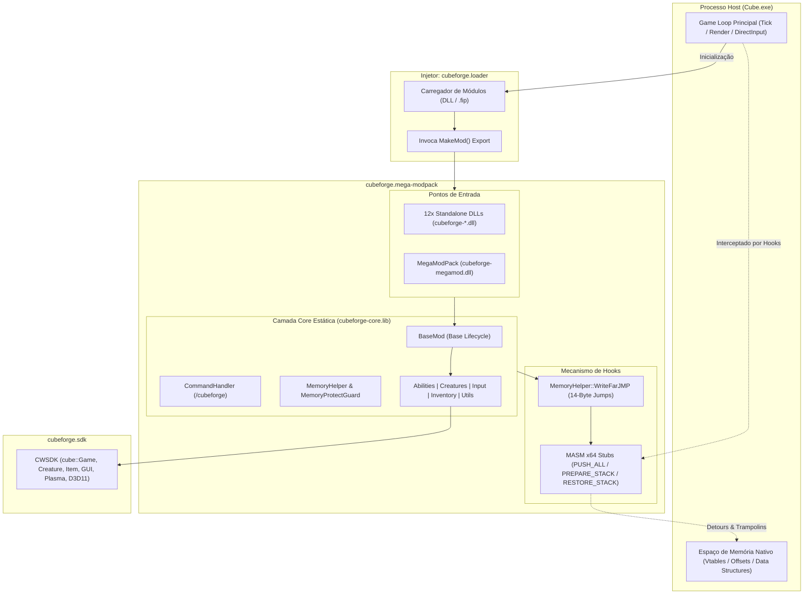
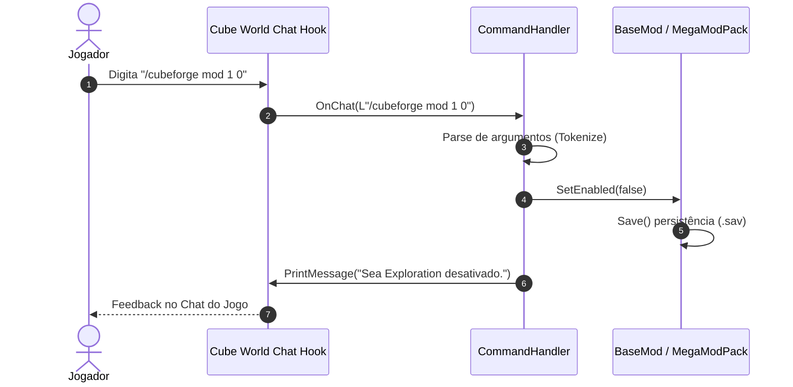

# Architecture & Technical Design: cubeforge.mega-modpack

[](https://microsoft.com)
[-00599C.svg)](https://isocpp.org)
[](https://learn.microsoft.com/cpp/build/reference/md-mt-ld-use-run-time-library)
[](https://blog.cleancoder.com/uncle-bob/2012/08/13/the-clean-architecture.html)

**cubeforge.mega-modpack** é um ecossistema C++20 modular e de alta performance para o lançamento Steam de **Cube World** (x64), concebido sobre o **CubeForge SDK (`cubeforge.sdk`)** e desenhado para interoperabilidade total com o **`cubeforge.loader`**.

O projeto adota o padrão **Dual-Delivery**, permitindo a compilação e execução tanto como **12 bibliotecas dinâmicas isoladas (`cubeforge-<modulo>.dll`)** quanto na forma de um **pacote consolidado agregador (`cubeforge-megamod.dll`)**.

---

## 📑 Índice
- [1. Visão Geral do Sistema](#1-visão-geral-do-sistema)
- [2. Camadas Arquiteturais](#2-camadas-arquiteturais)
- [3. Ciclo de Vida do Mod (`BaseMod` & `MegaModPack`)](#3-ciclo-de-vida-do-mod-basemod--megamodpack)
- [4. Subsistemas da Camada Core (`cubeforge-core`)](#4-subsistemas-da-camada-core-cubeforge-core)
- [5. Engenharia Reversa, Detours & MASM x64](#5-engenharia-reversa-detours--masm-x64)
- [6. Compatibilidade ABI, Memória & CRT](#6-compatibilidade-abi-memória--crt)
- [7. Roteamento de Comandos & CLI no Jogo](#7-roteamento-de-comandos--cli-no-jogo)
- [8. Persistência de Estado e Configurações](#8-persistência-de-estado-e-configurações)
- [9. Arquitetura de Testes e Mocks](#9-arquitetura-de-testes-e-mocks)

---

## 1. Visão Geral do Sistema

O diagrama abaixo ilustra o fluxo completo de injeção, despacho de eventos e interação com o processo nativo do Cube World:



---

## 2. Camadas Arquiteturais

A separação de responsabilidades segue princípios estritos de **Clean Architecture**:

```text
+-----------------------------------------------------------------------+
|                       Camada de Apresentação                          |
|         (Chat CLI /cubeforge, GUI Plasma, Renderização D3D11)         |
+-----------------------------------------------------------------------+
                                  │
                                  ▼
+-----------------------------------------------------------------------+
|                    Camada de Domínio / Módulos                        |
|       (12 Sub-mods: Sea, Lore, Combat, Creature, Shop, WorldGen,      |
|           Beginner, RegionLock, Weapons, Quests, Player, Stack)       |
+-----------------------------------------------------------------------+
                                  │
                                  ▼
+-----------------------------------------------------------------------+
|                   Camada de Aplicação & Core (Core)                   |
|       (BaseMod, MegaModPack, CommandHandler, Input, Abilities)        |
+-----------------------------------------------------------------------+
                                  │
                                  ▼
+-----------------------------------------------------------------------+
|                  Infraestrutura de Baixo Nível & SDK                  |
|     (CWSDK, MemoryHelper, MemoryProtectGuard, MASM x64 Detours)       |
+-----------------------------------------------------------------------+
```

1. **Camada de Apresentação**: Trata mensagens de chat, nós gráficos do framework `plasma::Node` do Cube World e overlays visuais.
2. **Camada de Domínio / Módulos**: Cada um dos 12 recursos implementa sua lógica isolada em `src/mods/<nome>/`, herdando de `BaseMod`.
3. **Camada de Aplicação & Core**: Fornece orquestração, despacho de eventos, abstrações de input (`DButton`), gerenciamento de criaturas (`CreatureFactory`) e ciclo de vida.
4. **Camada de Infraestrutura**: Encapsula o `cubeforge.sdk`, ponteiros globais de memória, chamadas nativas de engenharia reversa e trampolins MASM x64.

---

## 3. Ciclo de Vida do Mod (`BaseMod` & `MegaModPack`)

### 3.1 Diagrama de Estados do `BaseMod`

Cada submódulo transita por estados bem definidos durante a execução do jogo:

```mermaid
stateDiagram-v2
    [*] --> Unloaded : DLL Injetada
    Unloaded --> Initializing : MakeMod() -> new ModClass()
    Initializing --> Initialized : Initialize() executado
    Initialized --> Active : m_Enabled = true (Carrega .sav/.cwb)
    Initialized --> Disabled : m_Enabled = false
    
    state Active {
        [*] --> PollingInput : OnGetKeyboardState
        PollingInput --> ProcessingGameTick : OnGameTick(cube::Game*)
        ProcessingGameTick --> HandlingEvents : OnChestInteraction / OnLore / OnDeath
        HandlingEvents --> PollingInput
    }

    Active --> Disabled : /cubeforge mod <id> 0
    Disabled --> Active : /cubeforge mod <id> 1
    Active --> [*] : Jogo Encerrado (Save State)
    Disabled --> [*] : Jogo Encerrado (Save State)
```

### 3.2 Tabela de Eventos Suportados

| Callback Virtual (`BaseMod`) | Ponto de Interceptação no Cube World |
| :--- | :--- |
| `Initialize()` | Chamado uma única vez após a injeção da DLL no processo. |
| `OnGameTick(cube::Game*)` | Executado a cada frame do loop principal do jogo. |
| `OnGetKeyboardState(BYTE* diKeys)` | Disparado a cada leitura dos 256 bytes do buffer DirectInput. |
| `OnChat(std::wstring* message)` | Intercepta o envio de mensagens do jogador pelo chat. Retorna `1` para absorver. |
| `OnChestInteraction(cube::Creature*, cube::Item*, ...)` | Disparado quando o jogador abre ou interage com um baú de tesouro. |
| `OnLoreIncrease(cube::Creature*, ...)` | Intercepta a leitura de livros, pedras de lore ou artefatos históricos. |
| `OnCreatureDeath(cube::Creature*, cube::Creature*)` | Disparado quando qualquer criatura é eliminada no mundo (usado em Quests). |
| `OnShopInteraction(cube::Creature*, cube::Creature*)` | Disparado quando o menu de troca do NPC vendedor é aberto. |

---

## 4. Subsistemas da Camada Core (`cubeforge-core`)

A biblioteca estática `cubeforge-core.lib` centraliza os componentes transversais:

### 4.1 Abstração de Input (`src/core/input/DButton.h`)
Gerencia o estado dos botões do teclado via DirectInput com suporte a:
- Detecção de clique único (`Pressed`).
- Detecção de botão pressionado continuamente (`Held`).
- Reconhecimento de toque duplo rápido (`DoubleTap`) com janela temporal ajustável (usado no Dash evasivo).

### 4.2 Fábrica de Criaturas (`src/core/creature/CreatureFactory.h`)
Encapsula o instanciamento seguro de NPCs e monstros:
- Inicialização de atributos e offsets de vtable do `cube::Creature`.
- Ajuste de facção (`HostilityType`), nível, equipamentos e loot tables.
- Spawns customizados para bosses aquáticos (`Sea Exploration`) e alvos de missões (`Quest System`).

### 4.3 Sistema de Habilidades (`src/core/abilities/`)
Estrutura modular de habilidades de combate ativadas por teclado/mouse:
- `ConvertMTSAbility`: Conversão balanceada de Mana em Stamina.
- `HealAbility`: Consumo de combo points (50-combo) para restauração de pontos de vida.
- `FarJumpAbility`: Impulso de salto de longa distância.

---

## 5. Engenharia Reversa, Detours & MASM x64

### 5.1 Mecanismo de Desvio FarJMP (14 Bytes)

Para redirecionar fluxos de execução nativos do `Cube.exe` sem colisões de endereçamento de 32 bits, o `MemoryHelper` utiliza saltos absolutos de 64 bits:

```text
Endereço Nativo do Cube.exe:
[FF 25 00 00 00 00]       ; JMP QWORD PTR [RIP + 0] (6 bytes)
[XX XX XX XX XX XX XX XX] ; Endereço Absoluto de Destino de 64 bits (8 bytes)
Total: 14 bytes
```

### 5.2 Estrutura do Trampolim MASM x64

As rotinas em assembly (`hooks_megamod.asm`) garantem a preservação total do contexto da CPU:

```text
HookAsmEntry:
    PUSH_ALL              ; Salva RAX, RCX, RDX, RBX, RBP, RSI, RDI, R8-R15
    PREPARE_STACK 40h     ; Alinha a pilha em 16 bytes e aloca shadow space (32 bytes)
    
    CALL CppEventHandler ; Executa o manipulador C++ em modo seguro
    
    RESTORE_STACK 40h    ; Restaura o ponteiro da stack RSP
    POP_ALL               ; Restaura registradores originais
    
    ; Executa bytes originais substituídos do jogo
    ; JMP RetornoOriginal
```

---

## 6. Compatibilidade ABI, Memória & CRT

Para garantir operação contínua sem quebras de ABI ou vazamento de heap entre a DLL e o `Cube.exe`:

1. **Runtime Estático `/MT` (MultiThreaded)**:
   - Todo o modpack compila contra o CRT estático (`libcmt.lib` / `libcmtd.lib`), eliminando dependências de versões incompatíveis de DLLs do Visual C++.
2. **Definição de Debug Level (`_ITERATOR_DEBUG_LEVEL=0`)**:
   - Força o MSVC a manter o mesmo layout binário de iteradores e containers STL (`std::vector`, `std::string`, `std::map`) tanto em builds Release quanto em Debug, garantindo compatibilidade direta com as estruturas internas do `Cube.exe`.
3. **RAII Memory Protection (`MemoryProtectGuard`)**:
   - Altera permissões de página de memória (`PAGE_EXECUTE_READWRITE`) via `VirtualProtect` e restaura as permissões originais automaticamente ao sair do escopo.

---

## 7. Roteamento de Comandos & CLI no Jogo

O `CommandHandler` analisa e despacha mensagens que iniciam com `/cubeforge`:



---

## 8. Persistência de Estado e Configurações

O estado de cada submódulo é persistido em arquivos binários compactos dentro da pasta `Mods/`:
- **Caminho**: `<CubeWorldFolder>/Mods/<NomeDoModulo>.sav` e `settings.cwb`.
- **Validação de Integridade**: Cada arquivo armazena assinaturas mágicas e números de versão para prevenir carregamento de estruturas defasadas.
- **Restauração Automática**: Ao carregar o modpack, o `MegaModPack` e cada `BaseMod` verificam e restauram as preferências do usuário sem necessidade de reconfiguração manual.

---

## 9. Arquitetura de Testes e Mocks

O executável de testes `cubeforge_tests.exe` (executável standalone CTest) valida toda a lógica sem necessitar da inicialização gráfica do jogo:

```text
tests/
├── main.cpp                  # Test Suite Runner principal
├── test_framework.h          # Framework de assertions, timing e reporting
├── unit/
│   ├── test_simplex_noise.cpp       # Validação matemática do gerador Simplex 2D
│   ├── test_timer_and_events.cpp    # Testes de cadência de timers
│   ├── test_mod_settings_parser.cpp # Serialização e desserialização binária
│   ├── test_abilities_and_classes.cpp# Cooldowns e cálculo de atributos do Monk
│   └── test_quest_and_inventory.cpp # Ciclo de aceitação e entrega de missões
└── integration/
    └── test_megamod_lifecycle.cpp   # Inicialização, agregação e toggle do MegaModPack
```

